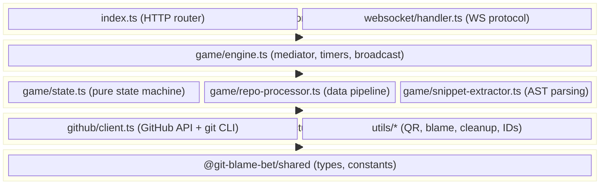
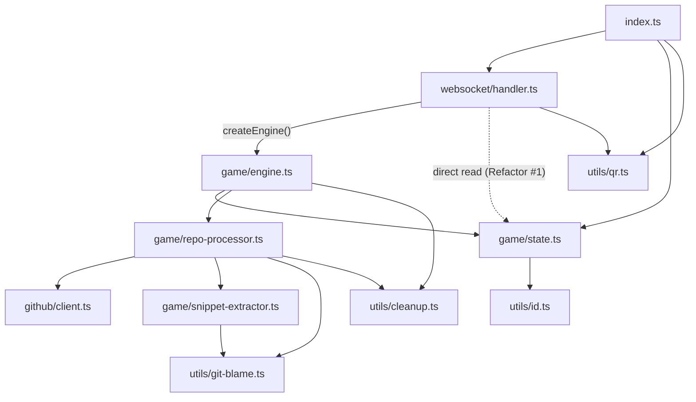
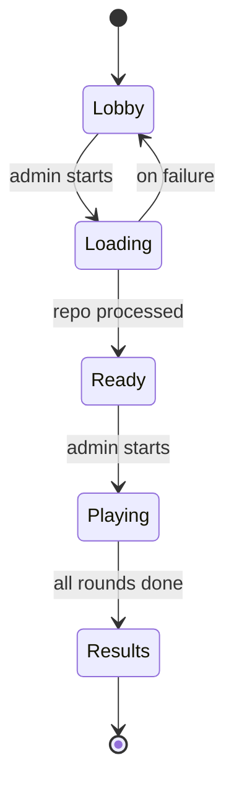
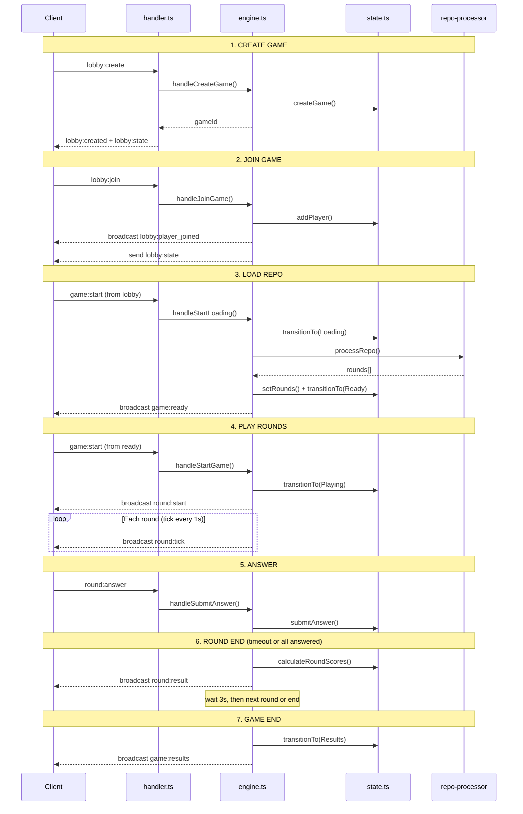
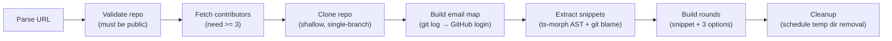

# Backend Architecture — Git Blame Bet

## Directory Structure

```
backend/src/
├── index.ts                         # HTTP + WS server entry point (router)
├── game/
│   ├── engine.ts                    # Game lifecycle orchestrator (mediator)
│   ├── state.ts                     # In-memory game state store (pure)
│   ├── repo-processor.ts            # Clone → parse → build rounds pipeline
│   └── snippet-extractor.ts         # AST-based TypeScript snippet extraction
├── github/
│   └── client.ts                    # GitHub API client + git clone
├── websocket/
│   └── handler.ts                   # WebSocket connection/message handling
└── utils/
    ├── git-blame.ts                 # Git blame parsing + email-to-login mapping
    ├── qr.ts                        # QR code generation
    ├── cleanup.ts                   # Timer-based resource cleanup (TTL)
    └── id.ts                        # Game code generation
```

**11 source files**, 4 modules + entry point.

---

## Layered Architecture



---

## Dependency Graph



Handler creates the engine instance at module level via `createEngine()`, passing
its WebSocket transport functions (`broadcastToGame`, `sendToPlayerSocket`) as
constructor dependencies. The engine is transport-agnostic — it never knows about
WebSockets, only about the `broadcast` and `sendToPlayer` function signatures.

---

## State Machine



Valid transitions enforced in `state.ts:93-118` via a lookup table.

---

## Data Flow: Full Game Lifecycle



---

## Repo Processing Pipeline



Orchestrated by `repo-processor.ts`. Each step reports progress via callback to the engine, which broadcasts `game:loading` to all players.

---

## Design Patterns

| Pattern                | Where                       | Purpose                                                       |
| ---------------------- | --------------------------- | ------------------------------------------------------------- |
| **Mediator**           | `engine.ts`                 | Coordinates transport ↔ state without direct coupling         |
| **State Machine**      | `state.ts` transition table | Enforces valid phase transitions                              |
| **Dependency Injection** | `engine.ts` `createEngine()` factory | Handler injects transport fns at construction — no mutable module state |
| **Pipeline**           | `repo-processor.ts`         | Linear data transformation: URL → rounds                      |
| **Repository**         | `state.ts` CRUD functions   | Abstract over in-memory Map (swappable to DB)                 |
| **Observer**           | broadcast/sendToPlayer      | Pub/sub for game events to connected clients                  |
| **Strategy Cascade**   | `git-blame.ts` buildEmailMap | Multiple matching strategies tried in order of specificity    |
| **Oversample + Filter**| `snippet-extractor.ts`      | Extract 5x candidates, filter after blame attribution         |

---

## External Dependencies

| Package                    | Purpose                         | Used In                 |
| -------------------------- | ------------------------------- | ----------------------- |
| `@git-blame-bet/shared`   | Shared types, constants, messages | All modules             |
| `ts-morph` ^24.0.0        | TypeScript AST parsing          | `snippet-extractor.ts`  |
| `qrcode` ^1.5.4           | QR code data URL generation     | `utils/qr.ts`           |

**Bun-specific APIs:** `Bun.serve()`, `Bun.spawn()`, `Bun.$`, `Bun.file()`

---

## Refactor Opportunities

### 1. Layer Violation: handler reads state directly

**Where:** `websocket/handler.ts:5` imports `getGame` from `state.ts`
**Used at:** `lobby:create` (line 104) and `game:start` (line 147)

**Problem:** The handler bypasses the engine layer to read state directly. This breaks the clean Transport -> Engine -> State layering and makes the handler coupled to state internals.

**Note:** The previous DI coupling (`setBroadcast`/`setSendToPlayer` mutable setters) was already resolved by refactoring the engine to a `createEngine()` factory. This remaining `getGame` import is the last direct state dependency in the handler.

**Fix:** Add corresponding methods in `engine.ts` that the handler calls instead. The handler should ONLY talk to the engine.

---

### 2. No route abstraction in `index.ts`

**Where:** `index.ts:100-111`

**Problem:** Routes are matched with manual `if/startsWith` chains. As endpoints grow, this becomes a maintenance burden with no middleware support, no parameter extraction, and no method-based routing.

**Fix:** Extract a lightweight router (pattern-match table or `Map<string, handler>`) that supports path params, HTTP method matching, and composable middleware. No need for Express/Hono — a simple abstraction over the existing pattern is enough.

---

### 3. `handler.ts` does too much in message handlers

**Where:** `websocket/handler.ts:93-180`

**Problem:** The `lobby:create` handler (lines 94-129) does socket binding, game creation, QR generation, AND sends multiple messages. It mixes transport concerns (socket map management) with application logic (QR generation, state reads).

**Fix:** Split into:
- **Socket management** (bind/unbind, socket map) — stays in handler
- **Application responses** (what to send back) — move to engine, which returns response payloads

---

### 4. Timer management is scattered in `engine.ts`

**Where:** `engine.ts` — `roundTimers` map (line 38), `startNextRound` (lines 140-175), `endRound` (lines 177-209), `endGame` (lines 211-227), `handleSubmitAnswer` (lines 245-253)

**Problem:** Round timers (`setTimeout`, `setInterval`) are managed manually with a `roundTimers` map inside the `createEngine` closure. Timer lifecycle (create, clear, auto-advance) is interleaved with game logic in 4 separate functions. If a new timer type is needed (e.g., loading timeout), the pattern must be duplicated.

**Fix:** Extract a `TimerManager` or `RoundTimer` class that encapsulates the tick interval + timeout pattern. The engine calls `timerManager.startRound(gameId, duration, onTick, onEnd)` instead of managing raw timer refs.

---

### 5. Unused code

**Where:**
- `github/client.ts:77-89` — `getRepoTree()` is never called
- `utils/id.ts:1` — `generateId()` is never called
- `GameConfig.fileTypes` and `GameConfig.githubToken` — defined in shared types but unused

**Fix:** Remove dead code. If these are planned features, track them in issues instead of leaving ghost code.

---

### 6. Hardcoded TypeScript-only support

**Where:** `snippet-extractor.ts` — uses `ts-morph`, filters `.ts/.tsx` only, always sets `language: "typescript"`

**Problem:** The architecture implies multi-language support (snippet has a `language` field, config has `fileTypes`), but the implementation only handles TypeScript. This creates a false API contract.

**Fix:** Either:
- (a) Make it explicit: remove the `language`/`fileTypes` flexibility from the types until multi-language is actually implemented
- (b) Abstract extraction behind a `LanguageExtractor` interface and implement TypeScript as the first strategy, with a registry pattern for adding languages later

---

### 7. `git-blame.ts` is too complex (236 lines, 6 matching strategies)

**Where:** `utils/git-blame.ts:13-147` — `buildEmailMap()`

**Problem:** A single 135-line function with 6 nested matching strategies, multiple loops, and complex fallback logic. Hard to test individual strategies, hard to debug when matching fails.

**Fix:** Extract each strategy as a named function or into a strategy pattern array:
```typescript
const strategies: EmailMatchStrategy[] = [
  noreplyMatch,
  numberedNoreplyMatch,
  emailPrefixMatch,
  nameMatch,
  sameNameGroupMatch,
  rankHeuristicFallback,
];
```
Then `buildEmailMap()` just iterates strategies until all emails are resolved.

---

### 8. No error boundaries in the processing pipeline

**Where:** `repo-processor.ts` — the pipeline is linear with no granular error handling

**Problem:** If `extractSnippets()` fails, the entire pipeline fails and the game goes back to Lobby. But some failures are recoverable (e.g., retry clone, skip individual files). Progress callbacks exist but there's no structured error per step.

**Fix:** Add typed `PipelineError` per step. Consider a result-type pattern (`{ ok: true, data } | { ok: false, error, step }`) so the engine can decide whether to retry or abort per step.

---

### 9. No persistence layer

**Where:** `game/state.ts` — all state in a `Map<string, GameRoom>`

**Problem:** Server restart kills all active games. No crash recovery, no multi-instance support.

**Fix (when needed):** Since `state.ts` already acts as a repository abstraction, introducing persistence (Redis, SQLite) would only require replacing the internal `Map` with a store adapter behind the same function signatures.

---

### 10. Magic numbers and inline config

**Where:**
- `engine.ts` — 3-second pause between rounds (hardcoded)
- `snippet-extractor.ts` — 5x oversample ratio, 4-25 line range (from shared constants but still magic)
- `handler.ts` — 10-second handshake timeout
- `cleanup.ts` — 60-second temp cleanup delay

**Fix:** Consolidate all timing/config constants into the shared package or a dedicated `config.ts` with named exports and documentation of what each value does.

---

### Priority Matrix

| #  | Opportunity                        | Impact  | Effort | Priority    |
| -- | ---------------------------------- | ------- | ------ | ----------- |
| 1  | Handler reads state directly       | Medium  | Low    | **Do first** |
| 5  | Remove unused code                 | Low     | Low    | **Do first** |
| 10 | Consolidate magic numbers          | Medium  | Low    | **Do first** |
| 3  | Handler does too much              | Medium  | Medium | **Do next**  |
| 4  | Extract timer management           | Medium  | Medium | **Do next**  |
| 7  | Split git-blame strategies         | Medium  | Medium | **Do next**  |
| 2  | Route abstraction                  | Low     | Medium | **Plan**     |
| 8  | Pipeline error boundaries          | Medium  | Medium | **Plan**     |
| 6  | Multi-language extraction          | Low     | High   | **Defer**    |
| 9  | Persistence layer                  | High    | High   | **Defer**    |
