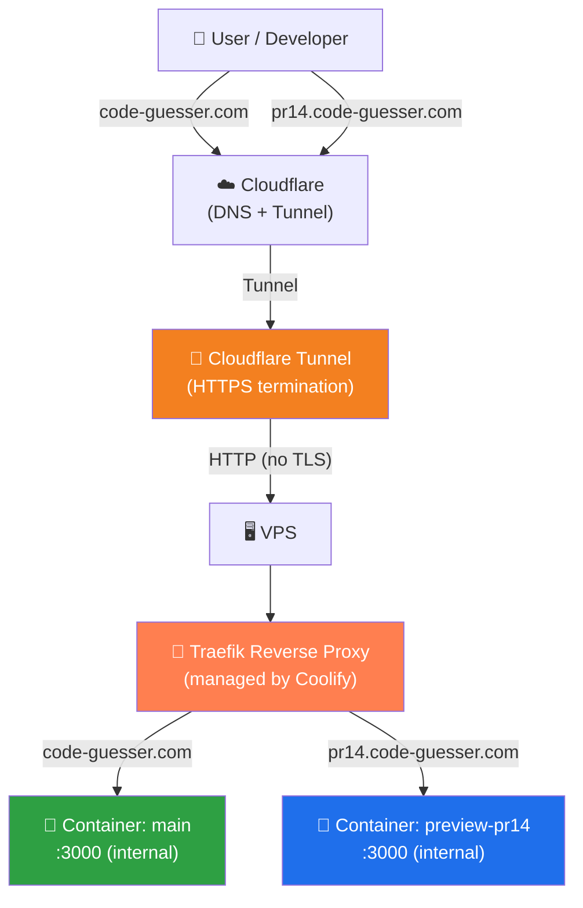
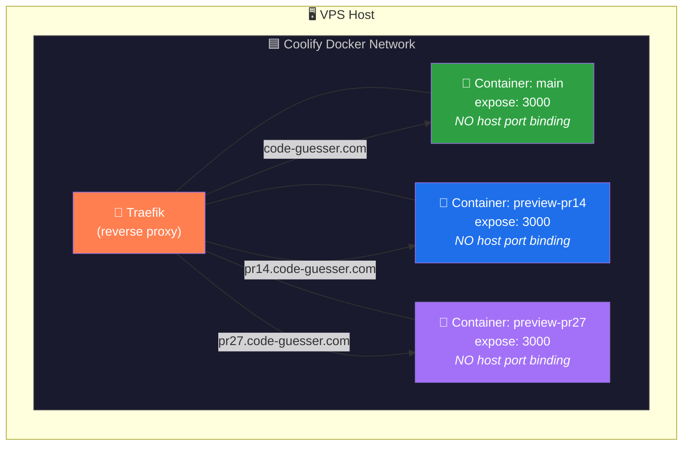
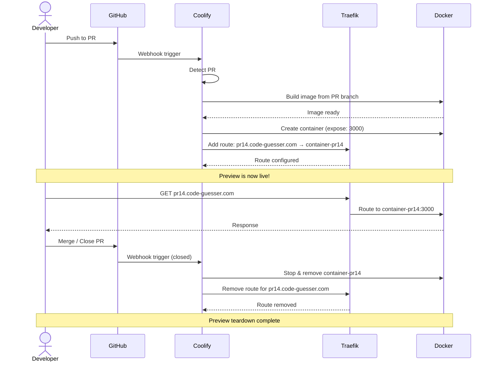
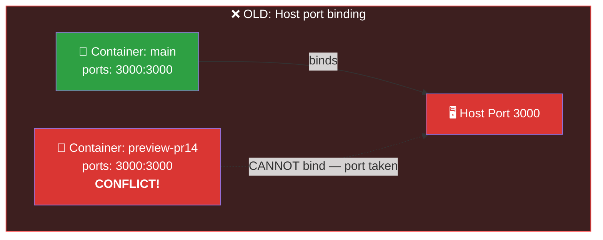
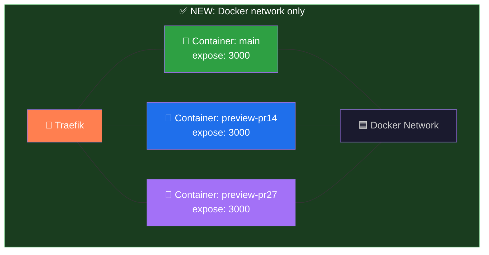

# Coolify + Docker Deployment Architecture

This document describes how Git Blame Bet is deployed using **Coolify** on a VPS, with **Traefik** as the reverse proxy and **Cloudflare Tunnel** for secure domain routing.

---

## 1. Architecture Overview



### How it works

1. **Cloudflare** manages DNS and provides a **Tunnel** that connects the domain to the VPS without exposing any public ports.
2. The Cloudflare Tunnel handles **HTTPS termination** — traffic reaches the VPS as plain HTTP.
3. **Traefik** (automatically managed by Coolify) receives all incoming traffic and routes it by **domain/hostname** to the correct Docker container.
4. Each container listens on **port 3000 internally**. Since there is no host port binding, multiple containers coexist without conflicts.
5. **Main deployment**: `code-guesser.com` → the production container.
6. **Preview deployments**: `prN.code-guesser.com` → a container built from a specific PR branch.

### Key insight

> The magic is that Traefik routes by **domain name**, not by port. This means every container can use the same internal port (3000) — there's no collision because Traefik decides which container receives traffic based on the `Host` header.

---

## 2. Cloudflare Tunnel Configuration (Crucial)

When placing a Cloudflare Tunnel in front of Coolify's reverse proxy (Traefik/Caddy), you may encounter **502 Bad Gateway** or **404 Not Found** errors if the tunnel is not configured correctly. 

### Fixing 502 Bad Gateway (TLS Verification)
If you route traffic through the tunnel to `https://<server-ip>:443`, Cloudflare will attempt to verify the SSL certificate presented by Coolify's proxy. Since Coolify might use self-signed certificates internally or the certificate doesn't match the direct IP address, Cloudflare rejects the connection for security reasons.

**To fix this:**
1. Go to your Tunnel configuration in Cloudflare Zero Trust.
2. Under **Public Hostname**, edit your domain routing.
3. Expand **Additional application settings** -> **TLS**.
4. Enable **No TLS Verify**.

> **Is "No TLS Verify" secure?** Yes. The traffic from the user to Cloudflare is encrypted (SSL), and the traffic from Cloudflare to your server's `cloudflared` daemon is also encrypted (Argo Tunnel). The "No TLS Verify" option only disables checking the certificate in the *last internal hop* (between `cloudflared` and Traefik on the same server) because Traefik uses a self-signed certificate locally. Since this hop happens entirely within the server's internal network, it is safe.

### Fixing 404 Not Found (Host Routing)
If the connection succeeds but you see a 404 error, it means the request reached Traefik, but the proxy doesn't know which container should handle it. The proxy relies on the `Host` header.
Ensure that the domain set in your Coolify application's **Domains** field EXACTLY matches the public hostname configured in your Cloudflare Tunnel.

### Handling PR Previews (Wildcard Subdomains)
To support automatic PR previews (e.g., `pr14.code-guesser.com`), you need to configure both Cloudflare and Coolify:
1. In Cloudflare DNS, add a `CNAME` record for `*` pointing to your tunnel.
2. In Cloudflare Zero Trust (Tunnel), add a Public Hostname for `*.code-guesser.com` pointing to your server's HTTPS port.
3. In Coolify, set the PR deployment FQDN pattern to `https://pr${PR_ID}.code-guesser.com`.

*Note: Cloudflare's free Universal SSL only covers one level of subdomains (`*.code-guesser.com`). Using a dedicated domain for the app ensures PR previews stay at the third level and don't trigger SSL privacy errors.*

---

## 3. Docker Networking



### Why `expose` instead of `ports`

| Directive | Scope | Host binding | Multiple containers |
|-----------|-------|-------------|-------------------|
| `ports: "3000:3000"` | Maps host port → container port | **Yes** — binds host port 3000 | ❌ Only ONE container can bind host port 3000 |
| `expose: "3000"` | Container port on Docker network only | **No** — stays internal | ✅ Unlimited containers on same network |

When we use `expose: "3000"`, the port is only accessible within the Docker network. Traefik, which is connected to the same Coolify network, can reach any container's port 3000. The host machine's ports remain untouched.

---

## 4. Preview Deployment Flow



### Step by step

1. **Developer** pushes code to a PR branch on GitHub.
2. **GitHub** sends a webhook to **Coolify**.
3. **Coolify** detects this is a PR event and creates a **preview deployment**.
4. **Docker** builds a new image from the PR branch and starts a container with `expose: 3000`.
5. **Traefik** automatically gets a new route: `prN.code-guesser.com` → the new container.
6. The preview is accessible at the subdomain — **no manual configuration needed**.
7. When the PR is **merged or closed**, Coolify tears down the container and Traefik removes the route.

### Automatic cleanup

Preview containers are ephemeral. Coolify automatically handles:
- Container creation on PR open/sync
- Container rebuild on new pushes to the PR
- Container removal on PR merge/close

---

## 5. Port Binding vs Expose — The Problem and the Fix

### Before: `ports: "3000:3000"` (broken for previews)



**Problem**: `ports: "3000:3000"` binds the host machine's port 3000 to the container. Only **one** container can bind a given host port. When Coolify tries to spin up a preview deployment, it fails because port 3000 is already taken by the main container.

### After: `expose: "3000"` (works with Traefik routing)



**Solution**: `expose: "3000"` makes port 3000 available **only within the Docker network**. Traefik, which is on the same network, can route traffic to any container. No host ports are bound, so there's **no conflict** — N containers can all expose port 3000 simultaneously.

### The change in `docker-compose.yml`

```yaml
# ❌ Before — binds host port 3000, blocks multiple containers
ports:
  - "3000:3000"

# ✅ After — internal only, Traefik handles routing by domain
expose:
  - "3000"
```

---

## Summary

| Concept | Detail |
|---------|--------|
| **Reverse Proxy** | Traefik (managed automatically by Coolify) |
| **Routing strategy** | Domain/hostname-based routing |
| **HTTPS termination** | Cloudflare Tunnel (before traffic reaches VPS) |
| **Container port** | 3000 (internal only via `expose`) |
| **Host port binding** | None — all routing happens inside Docker network |
| **Preview deployments** | Automatic per-PR containers with subdomain routing |
| **Cleanup** | Automatic on PR merge/close |
