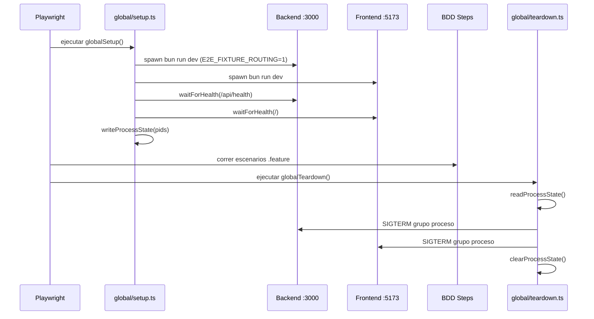
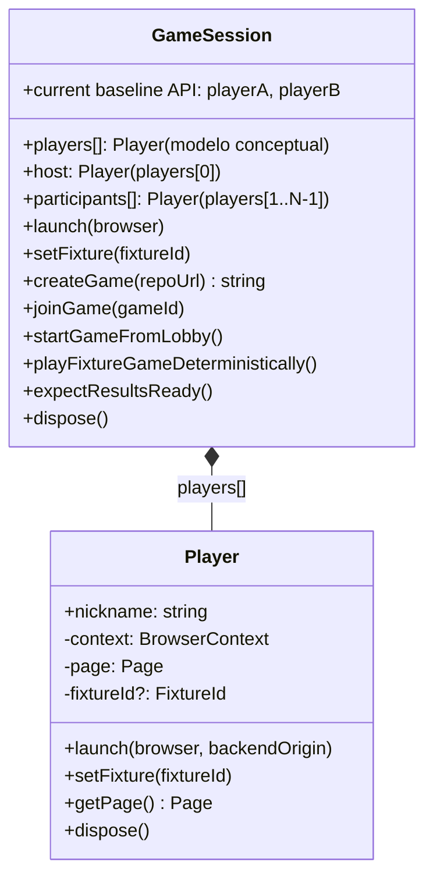
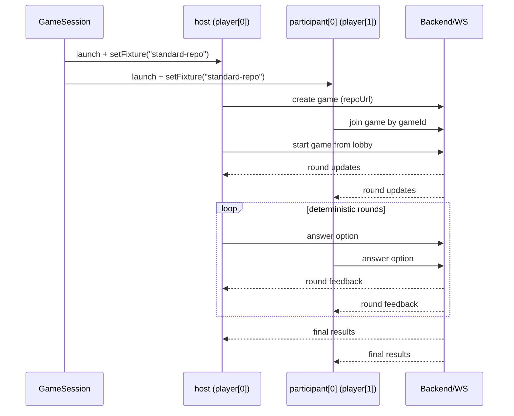

# Arquitectura E2E (#20 baseline)

## Objetivo y alcance

Este documento describe la arquitectura E2E actualmente implementada para el baseline de la issue **#20**.

Alcance de esta versión:

- Suite E2E en `e2e/` con Playwright + `playwright-bdd`.
- Escenario determinístico base de 2 jugadores (`full-game.feature`), sobre un modelo conceptual extensible a **N jugadores**.
- Estrategia de fixtures B (header + binding explícito por `gameId`) con gating de test.
- Flujo real FE/BE/WebSocket (sin mocks del runtime principal).

Fuera de alcance (próximos incrementos): hardening y expansión de cobertura de #21/#22.

## Principios de diseño

1. **Fidelidad de runtime**: se ejecutan frontend y backend reales en `globalSetup`.
2. **Determinismo acotado**: solo el contenido del repo se fija vía fixture `standard-repo`.
3. **Aislamiento por jugador**: cada jugador (host + participantes) usa su `BrowserContext` y `Page` propios.
4. **Gating estricto**: el enrutado de fixture existe solo si `E2E_FIXTURE_ROUTING=1|true`.
5. **Selectores estables por intención**: prioridad a rol/texto, con `data-testid` mínimos en nodos críticos.

## Estructura de carpetas E2E

```text
e2e/
├── features/gameplay/full-game.feature
├── steps/gameplay.steps.ts
├── support/
│   ├── fixtures/fixture-route.ts
│   └── session/
│       ├── GameSession.ts
│       └── Player.ts
├── global/
│   ├── setup.ts
│   ├── teardown.ts
│   └── process-state.ts
└── playwright.config.ts
```

- `playwright.config.ts`: BDD config, serialización (`workers: 1`), setup/teardown global.
- `global/setup.ts`: levanta backend+frontend (`bun run dev`), espera healthchecks y habilita `E2E_FIXTURE_ROUTING`.
- `global/teardown.ts`: mata grupos de proceso registrados en `.tmp/processes.json`.
- `GameSession`/`Player`: modelo multi-jugador sobre contextos Playwright.
- `fixture-route.ts`: inyección de header `X-Mock-Fixture` en tráfico backend (`/api` y `/ws`).

## Arquitectura de componentes (alto nivel)

> El baseline #20 ejecuta 2 jugadores, pero la arquitectura está pensada para escalar a N (`players[]`).

```mermaid
flowchart LR
    PR[Playwright Runner + playwright-bdd]
    GS[globalSetup]
    GT[globalTeardown]

    FE[Frontend Vite :5173]
    BE[Backend Bun :3000]
    WS[/WebSocket /ws/]

    S[GameSession]
    H[Host Player Context/Page\nplayer[0]]
    P[Participants Context/Page\nplayer[1..N-1]]
    FR[fixture-route.ts\nX-Mock-Fixture]

    PR --> GS
    GS --> FE
    GS --> BE
    PR --> S
    S --> H
    S --> P
    H --> FR
    P --> FR
    FR --> BE
    H --> FE
    P --> FE
    FE --> WS
    WS --> BE
    PR --> GT
```

## Ciclo de vida de ejecución



## Modelo multi-player (GameSession + Player)

El diseño de tests se modela en términos de colección de jugadores (`players[]`), aunque en el baseline #20 la implementación concreta expone dos propiedades (`playerA`, `playerB`) para mantener el scope acotado.



Notas operativas:

- Cada `Player` crea su propio `browser.newContext()` para aislar estado y routing.
- `setFixture("standard-repo")` aplica ruta de header en todos los jugadores activos de la sesión (en #20: 2).
- `GameSession` encapsula sincronización entre páginas (esperas en paralelo, asserts espejo entre jugadores relevantes).

Consistencia con implementación actual (`GameSession`/`Player`):

- Hoy `GameSession` recibe `playerANickname` y `playerBNickname`, y expone `playerA`/`playerB`.
- Los métodos de sincronización actuales (`launch`, `setFixture`, `waitForRound`, `expectResultsReady`, etc.) operan sobre esos 2 players.
- La semántica de diseño se documenta como dinámica para guiar próximos incrementos sin inventar APIs no existentes.

## Flujo end-to-end del escenario #20 (caso mínimo de arquitectura N-player)

Escenario implementado: `Two players complete full deterministic game and reach stable results`.

> #20 valida el mínimo de 2 jugadores (`host + participant[0]`), pero el flujo está expresado de forma compatible con `players[0..N-1]`.



Generalización a N:

- `participant[0]` representa el primer no-host; para N jugadores se replica el patrón de join/answer/assert para `player[i]` (`i >= 1`).
- Los asserts de estado se aplican al conjunto completo de `players[]` (en #20: host + 1 participante).

1. `Before`: se inicializa `GameSession` y se lanzan players del escenario (en #20: 2).
2. `Given fixture "standard-repo"...`: todos los players activos setean fixture.
3. El host (`player[0]`) crea partida desde `HomePage` (opcionalmente enviando `fixtureId` en `lobby:create`).
4. Los participantes (`player[i]`, `i >= 1`) se unen por `/play/:gameId` (en #20: solo `player[1]`).
5. El host inicia juego desde lobby.
6. Todos llegan a primera ronda (`Round 1/20`).
7. Se juegan rondas determinísticas (secuencia fija de respuestas del fixture).
8. Todos llegan a resultados.
9. Se valida podio estable (`results-podium-first`) y ganador esperado del baseline (`Player A`, nickname del host en #20).

## Estrategia B de fixtures (header + binding explícito + fallback)

```mermaid
flowchart TD
    A[Playwright Player Context] --> B[attachFixtureRoute]
    B --> C{Request a /api o /ws backend?}
    C -- No --> D[continue sin cambios]
    C -- Sí --> E[inject header X-Mock-Fixture]

    E --> F[Backend index.ts parseFixtureId(header)]
    F --> G[ws.data.fixtureId handshake]

    G --> H[lobby:create payload.fixtureId?]
    H --> I[resolveFixtureId(payload, handshake)]
    I --> J{fixture routing habilitado?}
    J -- No --> K[fixture undefined]
    J -- Sí --> L[fixture resuelta]

    L --> M[bindFixtureToGame(gameId, fixtureId)]
    M --> N[engine.handleStartLoading]
    N --> O[boundFixture = getFixtureForGame(gameId) ?? game.config.fixtureId]
    O --> P[processRepo(..., fixtureId)]
    P --> Q{fixtureId == standard-repo}
    Q -- Sí --> R[rounds/contributors determinísticos]
    Q -- No --> S[flujo normal de provider real]
```

Fallback explícito actual:

- Si el gating está apagado (`E2E_FIXTURE_ROUTING` ausente), `parseFixtureId` y `resolveFixtureId` devuelven `undefined`.
- Si no hay fixture resuelta, `processRepo` ejecuta el pipeline normal (`createProvider`, clone, extract, blame).

## Estrategia anti-flake (auto-waiting, selectores híbridos)

Base anti-flake implementada:

- **Auto-waiting Playwright** con `expect(...).toBeVisible()` / `toHaveURL()` en transiciones críticas.
- **Sincronización multi-página en paralelo** (`Promise.all`) para validar estado consistente entre players del escenario.
- **Selectores híbridos**:
  - semánticos por `role`/texto para opciones dinámicas (`button` por contributor login),
  - `data-testid` en puntos críticos de navegación/estado (`home-create-game`, `lobby-start-game`, `playing-round-feedback`, `results-podium-first`).
- **Determinismo de datos** con fixture `standard-repo` para estabilizar rondas/resultados.
- **Serialización controlada** (`workers: 1`, `fullyParallel: false`) para el baseline.

## Seguridad/gating de hooks de test

El comportamiento de fixture NO queda abierto en runtime normal:

- `isFixtureRoutingEnabled()` exige `E2E_FIXTURE_ROUTING=1|true`.
- `parseFixtureId` además filtra por allowlist (`standard-repo`).
- `resolveFixtureId` solo considera payload/handshake cuando gating está activo.
- `globalSetup` de E2E habilita la env var solo para ese proceso backend.

Implicancia: en dev/prod sin esa env var, el servidor corre flujo estándar sin hooks de fixture.

## Cómo ejecutar localmente

Desde la raíz del repo:

```bash
# Suite E2E completa
bun run e2e

# Solo escenario #20
bun run e2e -- --grep "Two players complete full deterministic game and reach stable results"

# Replay determinístico
bun run e2e -- --grep "Two players complete full deterministic game and reach stable results" --repeat-each=2
```

Precondiciones:

- Dependencias instaladas (`bun install`).
- Chromium de Playwright instalado al menos una vez (`bunx playwright install chromium`).

## Riesgos y próximos pasos (#21/#22)

Riesgos actuales del baseline:

- Cobertura limitada a 1 fixture y 1 path feliz multi-player.
- Dependencia de texto visible en algunos asserts (`Round X/20`, `Game Over!`) sensible a cambios de copy.
- `workers: 1` mejora estabilidad pero restringe throughput de suite.

Siguientes pasos recomendados:

1. **#21**: ampliar matriz de escenarios (errores de carga, reconexión, permisos, edge states de lobby/ready).
2. **#22**: robustecer contratos de selectores para estado dinámico y reducir asserts dependientes de copy.
3. Evolucionar estrategia de fixtures para más repos determinísticos y casos negativos controlados.

## Nota de diseño: escalar assertions y step definitions a N jugadores

Para próximos escenarios multiplayer sin sobre-extender el baseline:

- **Mantener #20 simple** con wrappers actuales de 2 jugadores (`playerA`/`playerB`).
- **Agregar helpers agregados** para futuros escenarios, por ejemplo:
  - `forEachPlayer(players, action)` para navegación/acciones repetitivas.
  - `expectAllPlayers(players, assertion)` para asserts de estado comunes.
- **Parametrizar steps por índice/rol** cuando se abra cobertura N-player (ej. host, `player[1]`, `player[2]`, ...), evitando duplicación de steps A/B.
- **Centralizar nicknames en una colección** para que validaciones de lobby/resultados escalen por datos y no por nombres hardcodeados.

Esta guía mantiene la practicidad actual y deja una migración incremental clara hacia escenarios de N jugadores.
